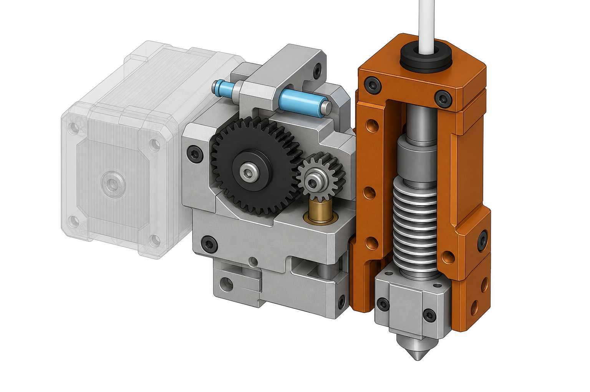
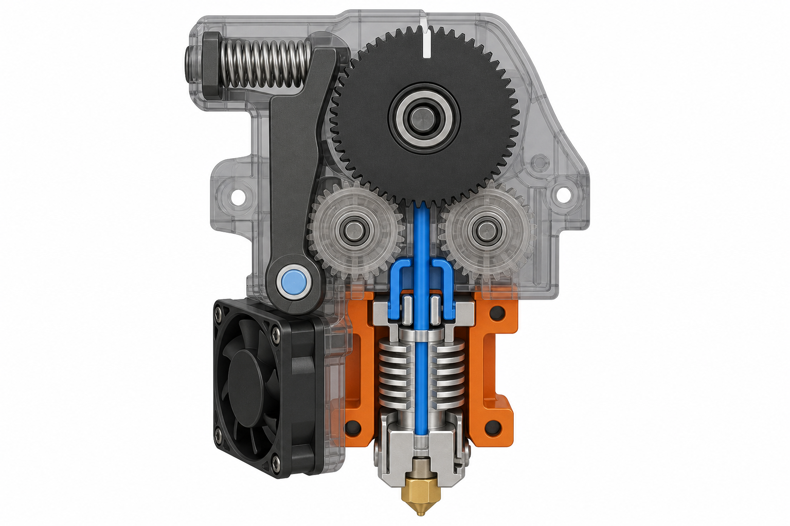

# Qidi X Smart 3 Hotend Changer

A Qidi X Smart 3 adaptation of [MedusaHC](https://github.com/Irbis3D/MedusaHC) — hotend-only tool changing with a single shared extruder on the carriage.

> **Upstream documentation:** configuration, macros, BOM, and assembly notes live in the [original MedusaHC README](https://github.com/Irbis3D/MedusaHC/blob/main/README.md).

## Onshape project

Main CAD model:

https://cad.onshape.com/documents/925fa174de77be992308194f/w/fca490ea28ff7be80e12406c/e/1c9cb7c5adcf7cfcde1a58d1?renderMode=0&uiState=6a1f367b6f648b43c2e4ed0b

## Preview

<p>
  
  
</p>

## What this fork changes

Reuses MedusaHC mechanisms (feeder open/close, sliding pins, magnets) and adapts the carriage, mounts, and coordinates for the Qidi X Smart 3.

| Path | Contents |
|------|----------|
| `STEP/qidi/` | Onshape exports for this adaptation |
| `STLs/Qidi/` | Printed parts for the Qidi build |
| `Config/qidi/` | Printer-specific configuration overrides |
| `STEP/0.1/` | Upstream MedusaHC reference STEP (feeder, hotend, toolhead, base) |
| `Config/` | Upstream Klipper config and MHC macros |

## Studies

Mechanism and toolchanger research collected during design:

- [Gear mechanisms](docs/studies/gear_mechanisms.md) — clutches, cams, latches, rack-and-pinion, Bondtech cam
- [Qidi platform](docs/studies/qidi_platform.md) — carrier plates, extruder, lever references
- [Toolchanger references](docs/studies/toolchanger_references.md) — DIY and commercial toolchanger examples

## Upstream sync

This branch tracks [Irbis3D/MedusaHC](https://github.com/Irbis3D/MedusaHC). Pull upstream updates into `main`, then merge into this branch:

```bash
git checkout main
git pull upstream main
git push origin main

git checkout Qidi-XSmart3-Hotend-Changer
git merge main
git push origin Qidi-XSmart3-Hotend-Changer
```

Add the upstream remote once if you have not already:

```bash
git remote add upstream https://github.com/Irbis3D/MedusaHC.git
```

## Credits

Based on [MedusaHC](https://github.com/Irbis3D/MedusaHC) by Sergei Irbenek (Irbis3D). See the [upstream README](https://github.com/Irbis3D/MedusaHC/blob/main/README.md) for full credits and license (GPL-3.0).
